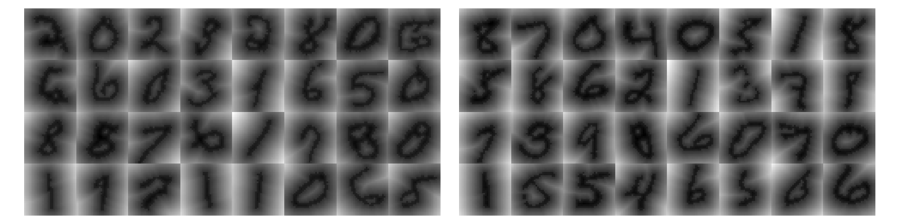

# DiT

[](http://www.repostatus.org/#concept)
[](https://github.com/dirmeier/diffusion-transformer/actions/workflows/ci.yaml)

> A diffusion transformer implementation in Flax

## About

This repository implements the diffusion transformer (DiT) architecture
which has been proposed in [Scalable Diffusion Models with Transformers](https://arxiv.org/abs/2212.09748)
in Flax. We test the architecture using the EDM parameterization introduced in [Elucidating the Design Space of Diffusion-Based Generative Models](https://arxiv.org/abs/2206.00364).

> [!NOTE]
> The architecture does not follow the [original implementation](https://github.com/facebookresearch/DiT) exactly.
> For instance, we don't use label conditioning and just use a learnable positional encoding for the patches.
> The rest is fairly similar.

## Example usage

The `experiments` folder contains a use case that trains an EDM (diffusion model) on MNIST-SDF.
To train the model, just execute:

```bash
cd experiments/mnist_sdf
python main.py
  --config=config.py
  --workdir=<dir>
  (--usewand)
```

Below are some samples drawn from the EDM using a DiT-B after training 100 epochs.
In my experiments, the UNet still works better, but that might just be how the hyperparameters have been chosen.

<div align="center">
  
</div>

## Installation

To install the latest GitHub <RELEASE>, just call the following on the command line:

```bash
pip install git+https://github.com/dirmeier/diffusion-transformer@<RELEASE>
```

## Author

Simon Dirmeier <a href="mailto:sfyrbnd @ pm me">sfyrbnd @ pm me</a>
